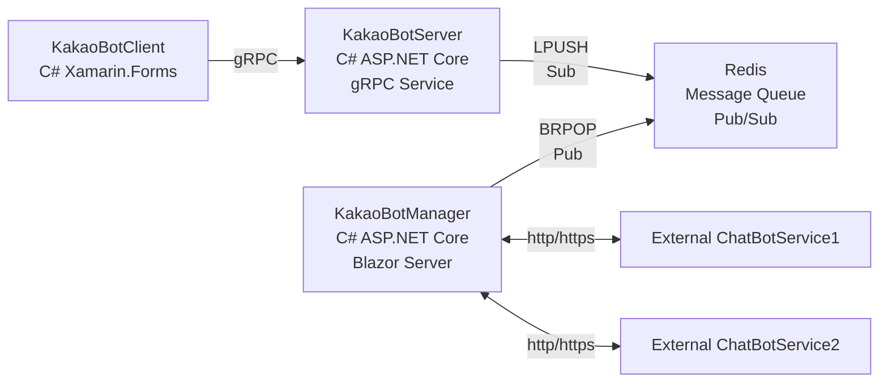
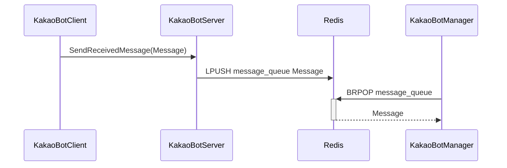
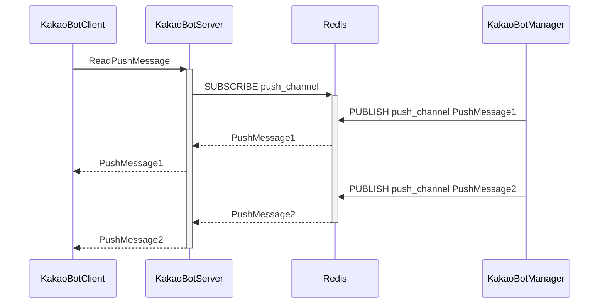

# KakaoBotServer
**카톡 챗봇 메시지 전송 서버**
- KakaoBotClient와 KakaoBotManager 사이에서 메시지 전송을 담당하는 서버

<div align=center><h2>📚 STACKS</h2></div>

<div align=center>
  
  
  <br/>
  
   
   
  <br/>
   
    
  <br>
</div>

## 프로젝트 구조
```
KakaoBotServer
  ├─KakaoBotConsoleClient
  │  └─Protos
  ├─KakaoBotConsoleManager
  │  └─Model
  └─KakaoBotServer
      ├─Config
      ├─GrpcServices
      ├─Model
      ├─Properties
      ├─Protos
      └─Service
```

### KakaoBotConsoleClient
- 콘솔 애플리케이션
- KakaoBotClient 역할을 하는 Mock 클라이언트
- 콘솔 입력으로 메시지를 보내고 푸시 메시지가 콘솔 출력으로 표시됨

### KakaoBotConsoleManager
- 콘솔 애플리케이션
- KakaoBotManager 역할을 하는 Mock 서버
- KakaoBotServer에서 보낸 메시지를 그대로 KakaoBotServer로 보냄(echo)

### KakaoBotServer
- ASP.NET Core gRPC 서버
- KakaoBotClient와 KakaoBotManager 사이에서 메시지 전송을 담당하는 서버

## 동작 설명

### 전체 구성


### 클라이언트 인증
- gRPC 메소드 호출시 파라미터로 apiKey를 보내서 인증 실패시 UNAUTHENTICATED 상태코드 반환

### 클라이언트에서 서버로 메시지 전송시



### 매니저에서 서버로 메시지 전송시



## 환경변수
`API_KEY`  
클라이언트 인증에 사용하는 API_KEY

`REDIS_SERVER`  
레디스 서버 주소

`REDIS_PORT`  
레디스 서버 포트